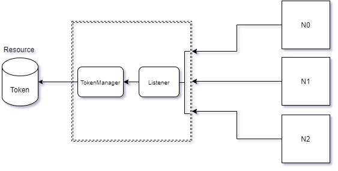
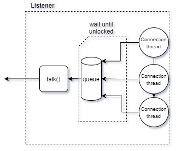

# Client - Server shared resource

Small project to describe a structure of multiple connections (through sockets) to a main server asking for a resource (
from now on, _Token_), in order to read its value and update it.

## Structure

The project is divided in two main programs: One of them serves as the Server, and the other is to create "Client"
connections to it, in order to ask for the resource managed by this Server.

In this simple structure, the main resource (Token) is just a number (integer) that would be shared among Clients.

Moreover, there are two main processes inside the Server that manages external connections (_Listener_) and the
interaction with the Token (_TokenManager_), isolating both sides of the operation.

### Listener

The Listener class will take care of every connection in a synchronous way, using First Come First Serves algorithm to
request and communicate with the internal resource and locking it until it finishes, while holding the incoming
connections until the resource is released.

### TokenManager

The TokenManager will receive every petition (frame), verify its correctness and apply the corresponding operation. For
this, we have two main operations: _Read_, to ask for the current value of Token, and _Update_, to increment this value
by 1.

Furthermore, everytime a new connection arrives to the Listener, this will add it to a Queue and send it to a thread
that will wait for its turn (this is, wait until all previous connections finish their interactions with it) and then
serve it.

By following this structure and these rules, we can ensure that every connection will be served at time and will receive
an accurate data from Token, without any conflict between them, since they will all be managed by a central server.

## Testing

### Client

**File**: ``NetworkClient.java``
**Arguments**: ``readonly`` or ``updater``

In order to test the connection to the server, an Operator class has been created to perform 10 Clients operations,
waiting 1 second between them.

There are two types of clients that can perform different operations: **Read-only** and **Updater**. The first one will perform
10 reads to the server and the second one will read and update 10 times as well.

Finally, in order to test properly, multiple client processes must be launched to verify that they will wait for their
turn
(for the Token to be released) and be served when corresponds.

### Server
**File:** ``Listener.java``
**Arguments:** None

Before launching any client, a main server process should be called, since it will open a port and listen to it.

The port number can be found in _Server.Utils.Constants_, in case you want to change it. This file is used both for the
**Server** and **Clients**.

## Execution

To execute both process just compile and run the files listed above. If you don't pass any argument to Client, it will
automatically create a _readonly_ client. If you're using Intellij IDEA, please bear in mind you have to _allow multiple 
instances_ of the program.

